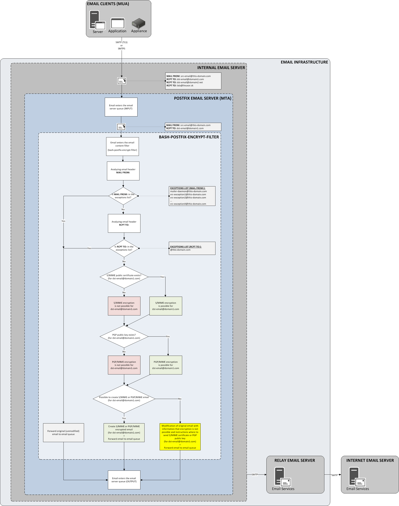

## Automatic Email Encryption for Postfix
**Date:** 2019  
**Author:** Ladislav Hajzer  

## Content 
* [About](#about)
* [How it works](#How-it-works)
* [Example - S/MIME email message](#example-smime-email-message)
* [Example - PGP/MIME email message](#example-pgpmime-email-message)
* [Example - Informational email message](#example-informational-email-message)
* [Installation](#installation)

## About
This is a postfix content filter written in BASH scripting language which automatically encrypt email messages with email encryption standards as S/MIME and PGP/MIME.

## How it works
1. Internal email server receive email message from some application/system thru SMTP (with TLS) or SMTPS.
2. Email message goes to Postfix "input" queue.
3. Email message goes to Postfix content filter (BASH-POSTFIX-ENCRYPT-FILTER).  
> Note: If original email has multiple recipients (MAIL TO:), then email server Postfix will generate single recipient emails which are then passed to the Postfix content filter. For example, if original (unmodified) email will have three recipients, postfix will create three emails with single recipient and those three emails are then passed separatelly to the Postfix content filter.

4. BASH-POSTFIX-ENCRYPT-FILTER analyze email header **MAIL FROM:** and compared with list of exceptions. If sender/source email address is listed in encryption exception list then original email message is forwarded (unmodified) to Postfix "output" queue.
5. BASH-POSTFIX-ENCRYPT-FILTER analyze email header **RCP TO:** and compared with list of exceptions. If recipient/destination email address is listed in encryption exception list then original email message is forwarded (unmodified) to Postfix "output" queue.
6. BASH-POSTFIX-ENCRYPT-FILTER check if S/MIME public certificate is stored (as file) in directory structure of BASH-POSTFIX-ENCRYPT-FILTER (/var/spool/postfix/bash-postfix-encrypt-filter/smime).  
> Note: If S/MIME certificate is present then S/MIME encryption is possible.

7. BASH-POSTFIX-ENCRYPT-FILTER check if PGP public key is stored (as file) in directory structure of BASH-POSTFIX-ENCRYPT-FILTER (/var/spool/postfix/bash-postfix-encrypt-filter/pgp).  
> Note: If PGP/GPG public key is present then PGP/MIME encryption is possible.

8. If BASH-POSTFIX-ENCRYPT-FILTER is unable to encrypt email with S/MIME or PGP/MIME then original email body is modified original content is replaced with information email with information that email cannot be encrypted and with information where to send S/MIME public certificate or PGP/GPG public key.  
> Note: Example of modified email body is in the section "Example - Informational email message".

9. If BASH-POSTFIX-ENCRYPT-FILTER can create S/MIME or PGP/MIME encrypted email from original email message, then encrypted email is created and then forwarded to Postfix "output" queue.

## Example - S/MIME email message
<pre>
To: dst-email@domain1.com
From: test@test.sk
Subject: TESTING email
MIME-Version: 1.0
Content-Disposition: attachment; filename="smime.p7m"
Content-Type: application/x-pkcs7-mime; smime-type=enveloped-data; name="smime.p7m"
Content-Transfer-Encoding: base64

MIIPLgYJKoZIhvcNAQcDoIIPHzCCDxsCAQAxggGbMIIBlwIBADB/MHUxCzAJBgNV
BAYTAkRFMSUwIwYDVQQKExxULVN5c3RlbXMgSW50ZXJuYXRpb25hbCBHbWJIMSYw
JAYDVQQLEx1UcnVzdCBDZW50ZXIgRGV1dHNjaGUgVGVsZWtvbTEXMBUGA1UEAxMO
VElLUyAyMDEwIENBIDECBitAMzWVXzANBgkqhkiG9w0BAQEFAASCAQBhNEwVK1xY
Atv6+iJaWP6k1K7O11vypFhBy/QixwBoF69uoZAeQyeZJ/8K2gahGf1yzxjQPU7C
xfoOj9+yw4x+OUR21j8UrtFla3lhUwjpNMxevWzLSMALGgqe2xcHDKX9E7d1ognF
37vAsMYS/BitmVIUL1QWDMI9sSMGh9aMa8l2IMA27IQimHKPLtwa8JxRV7Mafy04
n85PH3KNRi9CI6hwSgR+Gpp7M+okFcx/K1pyEOoP3MDJC++cwiw7t3W+/w051Zyg
9gOrcON9lWax3tSLURVAdoRsONQVU+Pv7EuG1F1uNMtSCHIEZRdgAFJw4mX4YXby
281KUQ4VvWO8MIINdQYJKoZIhvcNAQcBMBQGCCqGSIb3DQMHBAi0fo8OoQHmV4CC
DVADXf7WFtiKvRxnJfQ+/FhfsKT0R1EX8G9HVGn1xidKQiVbPVFxLKhCUa9HkRse
CdrWyXiCkaV2jQav2/HNTTWTjVVlAAUwPEdmUliXfxYkRtrPk3PxXhvxG5E7pf5U
TP+NPLUDdj2c+h1Nmzs6fK/ILH5d8BPT/bnCPjIIzHBHPGeDin0/ZlzPDsHMKTeF
prDlBDcxL7xWA2jA0iPVOx9/vRWqqc0Gn56ytjo7uYEy72wFoVHJ4v1zB1d+6F/W
qXgebyGKFTXqffkPkaS/YLjyKXJbUAv2BrKV3vtBoDKeiyx1/DOcY1erJHmxTD3Z
V3sL+E7N0XFLQ/dHLZ5WfTBfYmOFcyd7VLiHoPe9bvmsFI9EQHRN56b4g3vyFx6I
95AlXxdcf0BLIc2drkxYDUI1UP79lVEayuS6Eq2DLDpElBKihGXopK1wpx9FvipD
ByAmk/NM08GZtjxaheserKeGxg+3DB7g9piZcgxRH2WPECY/a8jBReAa2sDXwzEv
RgFaI5ehipcYOzGbKBmQl8AQ+Sc3iqMIexF0EyL6KDeQlPGQB6CZw2XDVGpG6M+U
ucQplWIVGyZnOZb1x++zQ8PYtzByOhdpMyaNbzatvlzf+E3ulaBXmPgfMGybCWNO
1GjrS9nuGsUHrqkdpdZZRT7f94p6NPaosMJJFDDVlgR0a8RBQLgbhTN2OoCXjVQ0
ee7yl2++0CtvfOS80gcRjQ2QPi3V8x7IdOi3oHwVyDkyGSMghBnq/+S/TzKhckTX
yRQPEeKMiv8uQ/NrQas5g1bPghnKDPbWT3yLiX9pss0uL69AuAPPznOVrxOV4Sn2
zDXlWVXUFQISB21VAfrvbLW6WOFejKmbzzzxkjj4MXEnoRWh/SQ8J/X+4KnF8xh3
qi2YcBwQa8M/jxG9yVlDysjp30QbhLIA8dA80HJd12Pg5p0gvVIBe0MCKnDOfSs6
7L3JFLxdN1xp7DRRwo3t+7R0MzxjUCMh70+9OKGI13V5BL7feP4VNF+uTX4+WWLf
0PLsCtBoyMdyeBkLf/z9Krug6Dqtg8Kr1muM+Im6yQnmvqxEtk5Wvgw6zDDdrbTQ
4joFEQCYFTOAMG5qVwrN6xANhsCdftznUnndwkdu4pUxL6fefzUJjPh+vSODbr+h
M4bcTAJemfn+c+Dp6pTErlSGND3k8jxd0MYG644ZdWaGrxgYxX/bDwnvyy77v5gW
61MDn4NXWm1wqCBgKozJJx4TffTQfqs2gU8ot1aL8qGw2a5l5QV8bxiD1Kl/w7Fq
SzbbZVuLq7SfVTApONBteOj08l4P890TcJv1AwYkYM6OXHpv6aeK1YnhggA17U0P
5z+reFIi0uaN0Nyjbr5IucGe73MxsRKCwYTBl518qRKR6ZURkCV4t9Iu5EIA5FOH
iYu+iV8uaTF6byE/8PzP/Iarc3CPMMvd4xJzF/ycwBsR8mGNHSQFSclT6dEx86AY
27s7TTxxpOuV0mOrmZx61wHXT8s/dOofAUfCxFasFhHS4uL3McXh9Cg+3pkE3z40
hPj1XrPoZ1/dM9SzdyrF1kGOT92X2FLA2BjPEr9Er0akTfaHeDvcZ4/sWzKRjPID
KYecJu8uVckqSNHx6Mkd0RZbDTtsztsZn9VN+sZmDJ2psiPp40M8jEtzDMS+AB/a
rD2DoY7DOTkQn1ybhDsBvq02sFhSMNzyy2zU9RWxnN7yqNYIUG/2EdInJybJ7ZnO
QVmfxQou6+oM4C1sM13FvekHpS6msRDzeFZNtt/z5VuQ1BxLID/0BBiEfBHoCksX
GEwuuNdklUs3sclSQ1pT5ENfdGyhTR6qDtY7TvottRAeM3zaRW0rMcV3QggV2xwW
HKCz09yYK1b1CCDG5cVCUqZM5jQ020dT5JrdreT1hndKcrnbxsAfYl55ytRvLcmt
eGMitgNgn8Yzz9qjSXm0IQ4nI/PuYamdbBR4aMPdTovdDpwYSrqVMn/iJJV2idm/
hR7z5nXA0CYpp4GFs+o8qLlSAjQDOBEXinuW2lYdevCE+121vE/wjXZrPDZ3gqZ8
mPtyvSeWx6FDaiFyiWJljis/mbxILWYaZyiBV+CyBm1MwwGZSka5ofKcER/9bFZ8
SxSsg9Drccq6cqAi48kVo5zYYAbMCk3XSpbgjl2Hp6/iCaFCL82hAaTUcnPBvgol
bUtvZYzSrON4nWizu/7eATM8AGsYbjZ/IbjPfnvhsOk5kYIjxByCbw5extf9kNyf
0pcow+UMwCQglh4kuC1SwMksLdDm8Hh5bOuQf+8kj+zZrwymc3tF0Lvvs9o7WTHy
1SwBpklBsPx44VvtIblQfCRWozcyT2ZIJQn+fa8xKC9z+UuEoma2BkaQhJMrGzr5
j8/YGrIlW457CktjMbznKZIpehEr1BP6UvZChsiCrBFkJe+VBwUMdv1qsutIN+PY
RTONJHHcPURWn0MOoI1AG4IzKR7P/FVAQ/FPobHcpaExdPQjM8JaeGAe0N5OJupE
FQBTEBpPBdfw7LWZsTeJTUvcKMH77PFKIZxOxsZXiGOFEIU8hPwUiP2kIpwuJYzm
O3/lmumWZ1IlDMcWlepn21JTRfDOa8H+EYYw6Re8Z91ebMx5xaP5x8IRrArb91Fy
tR4ncMMVminmTGkqOKE0l3+dNj6+NJOnuy4VaNpXy+haKkGJ9Q6qHjeS/IuIbtU/
zf/F5YkcAk3tjw0md0Gt3ip3sh1kG9BSu8WLREtSKt6iOuLDHZVQ5SbYphNVIuxU
4cZ8Yqi1EmlLzpFIRnyxZMMVXcWhjOrqYPWbpZ964WIWXcgtN5zXo9rMcZ12RGVx
VyOpTMbeBV7wPdrngkgswhm4+M6iYdlLv4yH/p/XP+jF2KP0B9EmQ5s70DxHPsth
/5bajCvXJ/wv3z61nTYw1UyXYXhXYsRALqcKa8OYMOI4fAnAtv6mxNDlWuZdj5/L
vPZFv7VrJAMYWDIxeixEhcDoiloNHVUE5tDB2yWbrCvs8Ao28xNvKGpRsMxYt/1k
wJ9dpQrxuF4JR+vmICiKsD3TKgsqOUqJsSXfV0nTWcDoRIFzSsy9+zLRQFmciu7C
DhT9s3ljK6qx9+pTB9O67eeFVDPdKNWZ0UDx05MzyBd/LdwoZDnuYj6VBorvAsge
O/EBxklkT8/Q/OYYuyY3jO4zPfAljT12wAVC7ChFEdGdsjK4+uNBNPUKTnIPG/qL
JLqllNnmLMo4CqE4UlKZn2xUSKnIqu8jhreVytLVdV6KP63zRph61Z1hMGmGmxAN
VryrhCuxY9Mi/JyWqgCxFK5hkf8ZSQraMjy2nvipJ2v2m2dTrJ1qE9DgY9Qe987N
X9WAqu4sIapi4dpXA5VkytFddd/KxZDPE+NdA8ow939l+NbAHqJ2Px7SWZsoMjbP
0i5Jjet4dYetlzGxJnOKgGw67SvjRV/z9MtM5LyyWAvYK/YUOSrsKcytJ3ewED8r
kPW5aVmvF745mwobUkFvhDpi5QD/5VUj/oiyZIxz2S8Vu4EenEB7ygg/Qd3bE/ww
xk148JcfVvIT3BuvicjW3C72hwpkrWpQbDmlRpWLSsfA/fEb/mej0ihUvEnx5QkS
k0iDx8DFMZahQZwXm9bE+BgW9LhKOWitXVPTTSSvk74uxOQ4GXx1B/fRkD5C5/l4
03bPSvbaIdwiC5mrxhRWEplEvDrjClqNvQvkCAWEA57v4vNY9EPPZnWBnwzKihW0
RO4k7HPjNdFms5DrmJfcK3+esuYroZ7HN29gUO0sV0hX4liLp1/nTH6K6skJ/7LY
7hRhkR6kViSfPfzqOh9tR5fy3m7L3EweAuxdMeI17JEBWfE0wGYuYSSkKxN4CCmD
WcOpKBo5A3+WiDu8vHlHdl65nzIxxUaNgCpJ15yXERG8UPVSWLG0gI2RAyqjEtry
SZS+h3cVp/Elgq2Tb9o7T2S3XtwomL7eeHugpYLrwDPsZHQ3vhJnBU8MRS8W30J3
6NFh/MTeJSE1u1x1Uk0u7JC+/3LQdvbWE0lHulzso0diQRu5F3Nd5ExTOsFqqUNO
ta+56YDh6b63cawkW3ZjWZb2pj6OhO/hEc7XDg0yaPeBAi1blsFmN1LXtrBxExdE
GcJ1SA4GNE6IDOAMPNW8icXeK8eRcRGmpf/h8tLh99rJnnNwFImf/9WHOLq2EL72
Lzek9pFDlM+5ly2ubf0LpcYBGZiivn11rfhPlgkDJKVlDVLWOUmOeQ9YGdpogyO6
yxqGszvLOhFtUgKLsSOD1WdQUP1iGZlayb5CzNVMgefHZ4z5RT76IBUNLfqbJJew
AmKPVjPkfirMnZLWbSO5If9frlj0RQNAKi10hX2PsdLp3ASSNMjPfP2GUUP3ieSM
07iG1MMX54DnXjN94F7+fq95jy/ROBRZm8Ye7TqwXfBnIrVdYPZm7j13+FU/6R/5
0xnFHdu3BqHxh/gAJRs2ffUUAqSxWPV2zNV6GV/HfEu2AAUs8HjstKkef0RCOo1j
Eydl87qzmSgcYecSA+mQGBx7pDNDKkXEN2IFjzwjHGWfIPVo8swVFk2Yl2wExeuu
utc=
</pre>

## Example - PGP/MIME email message
<pre>
Date: Wed, 14 Nov 2018 13:33:14 +0100
From: test@test.sk
Subject: TESTING email
MIME-Version: 1.0
To: dst-email@domain2.net
Content-Type: multipart/encrypted; boundary=74c39984-e809-11e8-80f8-00163e000017; protocol="application/pgp-encrypted"

--74c39984-e809-11e8-80f8-00163e000017
Content-Type: application/pgp-encrypted
Content-Description: PGP/MIME version identification

Version: 1

--74c39984-e809-11e8-80f8-00163e000017
Content-Type: application/octet-stream; name="encrypted.asc"
Content-Description: OpenPGP encrypted message
Content-Disposition: inline; filename="encrypted.asc"

-----BEGIN PGP MESSAGE-----
Version: GnuPG v2.0.22 (GNU/Linux)

hQIMA0VpDUosV+vSARAAjqahPx/dkB1N5+VRwrQZ6Ik7vhubchxxXSY65AGK9llf
7UTVwmLvSx9uadw1s7wKZqtlP+jlctvDk8DgbuM6MXVaCWLFg2q4dKNV5yAneBDT
TKLuAXFhlJfdGyI3fozEfTCf7GH/cBHwRbTnzyJY9lHyJvRIg8tng+ekII6gX2eR
2GnJD6sjqfrRLnjpZdTQfL8nX9ZFVnbf3j5IMjpo3tSAPWNHkKAIYsUYyK8OlK7x
fOHXTqdJMNAG1bOpvSN1/i9wmIval6hbHXfPcNuC/1yLYLQ13k8FgZMwmxO58h5+
+CGrOGuj6m5a2zHRaj3UDO0ITZpzcAG6QD4T4n9/8z0tQdjoZzuCU/VnwWevynw5
Xxf6UOf9KJvb/Onu7tVlbVB/opLYLsnlZDVSfhN7/5Kcpfc+IVu2ewbQs3ud2NMg
FON/m/av0fgFhTplVuEdJVUYwcBDvzgfE36Pu9l2IIRHP8OY8hs2HcR6cRbMrKaL
zzJUoshHcbKj1YOBzZhFKZtO1CImR1j48P3rDjutVtdT1KPJjeBswfH//aTRhLqL
vruGHjlCAyHAWnT3GhvPQRYYW8dR8BtWUe1N2GQkgojA6TzaSUvvZbNd8eiJuZ6O
Y3ulR27gfxwM8t3Gm57BXC6H64EaGvwfPA0NxzlO0JwUcHRq8RAepr9JQPhiQ83S
6gE8qYT4kk0IsfVAYALXqLJBIKeu5bVDTEpQBZ9kKGDVpseF7h8IuJFwcAGGSpSn
sJDPxKwcHdF+wKaypQ+8X5As23TgLedotNoml4e1cI0kyOQCeYG+M1Nzt56G0o4M
PbtZoF1S7RqjDtEVJ5N6wIYUL9iJlWjr9ZPBIUYadGbhkxAv9D4DZ9Nnhuf3UI/R
SBYgR9lyeU6A72z6yOQKdQvZfCz2ZkLbyNpthXvN7QvhP+QAqvemwBz3VViwrkiI
mwQsxO+/NENOAgdqlvRdpzyFNIuE3gv895CVfuFfsXkCMgP4SG9tDd1+GvyWrPuZ
gjkmPqA9f2cmiF6aMdpmvtJd5mq5t605sOQMb25dPosCkFyiLj/nHl6UI/hxjWgD
EHnzuY48KaCep0NHDlWOvpQgiDloB9m2FXTWRWUw7UXqVql3QEkgVfsFZw65+4Q4
SG754SHndDtu24nGaGKrXbqVFGAZQPxoXw/pm1FWpPASy3ERsd+/XxW+ni4yzdAJ
QDoOIhvvZVqvEsAxpotlXK93OoDivjhCBNrOW0QKfkn6Dp7+FBsHOBIn1B8fIlWH
9YCbpj7nApPYx67g7s+qHChVwDmk9jGYQwrODd0jGayHInGXuIRXEr79mY6JSwMD
KEFm31uiYNULadNA1GQt5HwjvObfUZVGwSuYYDOwtaO/jxACbRtOUrEx01Z1rqSA
EFjA3Vfm99Tki++6kvLYwS3IIIVO5Vge5RHnUet3aDcud33DW42tQphNefjhpSKa
BeHKEl/YeedvRrpejvyy0sb8CpF6nIgN9vRlFz+CBkJJ4f49J15ZrvtmDnFRBTB8
SzlIFxiLb/0PtKf1gfoowBhRWSbAYXxQ2jbNu5y2JyD2CxccI0dEz74bGorzXCkz
mzrpoEdy0FT49hTutcy/SJ33rXtEJdEnxJ2215vNqVgtx/oJlOxXp+Ug1LMM1DG7
mss0nvlDhGR6qk2meuSXfg7pq4q1gRKRJhaCePk0mQZKAhN/vkrN+TUM+z9qUxk0
Ky+xYz4mCbgmyeczgenc6CfyxytP+Hrjg4CgLXSd0itpcBEJXwopPFaTJqtEFOzl
jcneC6Lj5hSpLvxzwMFEPCVJqzDz7MnPCARenaekzTDFQ8uNpBAJnNFEB1e1g004
VTS8HrxaHl/OPgtQUrhDwL1SACfx+R2lT7IirbmKJySo33E5sAY0KMJHx3JbNXiZ
wVLD3eu7siBLid+WFpJa6pP8PjTcv2LrO46ghJ8PImc7jjA1PEQv4Lt1/SrcVqQJ
1gxnpJqC0dATMbzZzQ/IDx1q5vOo9ShMk2qq1YhneC12t6mr/P8vt0QnDK/U7hCn
MeMYji9hiiknFhPlbHg7cbvAiYi1a7+e77+a2Myn33XuwVq0ULNWJffXDG15+Nvb
VX4rDXLhaBv/UGcfsyfIizlBi4moz8sbKNNXWEcX2KL1SYNe9Ct9t/k4W0zStQI+
9vgqyH7DHmUs2YSNYmOYLEeo9S7XBKuAjDzSBQ5zAxOFaJucslO0My6AW/lUT9/t
xKXNzNXtjydcufITqjl04cnPXgeWbuVFoBTz7EgUy846YEvki4S401i+KJuveNAM
/tgK6+ACnxQAXLkyfgvd27zzeaPFt6aTMcBvft/M5tImavFoWU58y7nGof7EJDm9
JYF+gETzFxQVgYQ3Q3w9GJ0pf7OQjWwp5/Gi/G1zF2lO6cp0ZOBkruB3y+NuRGbO
79ShPd9awXXYysQWffeeFkPOlzcF2gfaoMVm4NUdBkrlsqt2U/LYHwXvTj9fSn2M
N+zfkzvyEHmgP5RU
=EGTW
-----END PGP MESSAGE-----

--74c39984-e809-11e8-80f8-00163e000017
</pre>

## Example - Informational email message
<pre>
From test@test.sk  Wed Nov 14 13:33:14 2018
Received: from system.this-domain.com (localhost [127.0.0.1])
        by mail.this-domain.com (Postfix) with SMTP id 850D31470;
        Wed, 14 Nov 2018 13:33:14 +0100 (CET)
Date: Wed, 14 Nov 2018 13:33:14 +0100
From: test@test.sk
Subject: TESTING email
Message-ID: <5bec160a.p3HuVox6szultDqc%test@test.sk>
User-Agent: Heirloom mailx 12.5 7/5/10
MIME-Version: 1.0
Content-Type: multipart/mixed;
 boundary="=_5bec160a.NhKsITer09OFhaPH0MGOj6MhS0/HQIyVVyeMGfiNr1Jd8S4g"
To: lala@linuxor.sk

Dear recipient,

email message from address 'test@test.sk' was targeted to your address 'lala@linuxor.sk', but our email system don't have your S/MIME certificate or PGP/GPG public key. If you want to receive encrypted messages please send your S/MIME certificate or PGP/GPG public key to email address smime_pgp@this-domain.com.

Thank you for your understanding and cooperation.

Best regards
This-domain.com team
</pre>

## Installation

0. Install prerequizities/dependencies.
<pre>
# yum install openssl gnupg2 procmail awk
</pre>

1. Add user for content filter.
<pre>
# useradd bash-postfix-encrypt-filter
</pre>

2. Upload the script to email server and copy to desired directory + set correct owner and persmissions.
<pre>
# cp /tmp/bash-postfix-encrypt-filter.sh /usr/local/bin/
# chown bash-postfix-encrypt-filter:root /usr/local/bin/bash-postfix-encrypt-filter.sh
# chmod 500 /usr/local/bin/bash-postfix-encrypt-filter.sh
</pre>

3. Create directory structure for content filter + set correct owner and permissions.
<pre>
# mkdir -p /var/spool/postfix/bash-postfix-encrypt-filter
# mkdir -p /var/spool/postfix/bash-postfix-encrypt-filter/archive
# mkdir -p /var/spool/postfix/bash-postfix-encrypt-filter/log
# mkdir -p /var/spool/postfix/bash-postfix-encrypt-filter/pgp
# mkdir -p /var/spool/postfix/bash-postfix-encrypt-filter/smime
# mkdir -p /var/spool/postfix/bash-postfix-encrypt-filter/work
# chown -R bash-postfix-encrypt-filter:root /var/spool/postfix/bash-postfix-encrypt-filter/
# chmod -R 700 /var/spool/postfix/bash-postfix-encrypt-filter
</pre>

4. Create file with sender (**MAIL FROM:**) email addresses as encryption exception list + set correct owner and permissions.
<pre>
# vi /var/spool/postfix/bash-postfix-encrypt-filter/exceptions_encrypt_from.txt
--------------------------------------------------------------------------------
mailer-daemon@this-domain.com
src-exception1@this-domain.com
src-exception2@this-domain.com
----------------------------------------------------------------------------------------------------
# chown -R bash-postfix-encrypt-filter:root /var/spool/postfix/bash-postfix-encrypt-filter/exceptions_encrypt_from.txt
# chmod -R 400 /var/spool/postfix/bash-postfix-encrypt-filter/exceptions_encrypt_from.txt
</pre>

5. Create file with recipient (**RCPT TO:**) email addresses as encryption exception list + set correct owner and permissions.
<pre>
# vi /var/spool/postfix/bash-postfix-encrypt-filter/exceptions_encrypt_to.txt
--------------------------------------------------------------------------------
@this-domain.com
----------------------------------------------------------------------------------------------------
# chown -R bash-postfix-encrypt-filter:root /var/spool/postfix/bash-postfix-encrypt-filter/exceptions_encrypt_to.txt
# chmod -R 400 /var/spool/postfix/bash-postfix-encrypt-filter/exceptions_encrypt_to.txt
</pre>

6. Define and enable encrypt filter.
<pre>
# vi /etc/postfix/master.cf
--------------------------------------------------------------------------------
# Definition of BASH postfix encrypt filter
bash-postfix-encrypt-filter    unix    -   n   n   -   -   pipe
flags=Rq user=bash-postfix-encrypt-filter null_sender=
argv=/usr/local/bin/bash-postfix-encrypt-filter.sh -f ${sender} -- ${recipient}
# Enable BASH postfix encrypt filter for SMTP only
smtp      inet  n       -       n       -       -       smtpd
-o content_filter=bash-postfix-encrypt-filter:
# Enable BASH postfix encrypt filter for SMTPS only
smtps     inet  n       -       n       -       -       smtpd
  -o syslog_name=postfix/smtps
  -o smtpd_tls_wrappermode=yes
  -o smtpd_sasl_auth_enable=yes
  -o smtpd_reject_unlisted_recipient=no
  -o smtpd_recipient_restrictions=permit_sasl_authenticated,reject
  -o milter_macro_daemon_name=ORIGINATING
  -o content_filter=bash-postfix-encrypt-filter:
</pre>

7. Set maximal number of recipiemts per message delivery for encrypt filter transport.
<pre>
# vi /etc/postfix/main.cf
--------------------------------------------------------------------------------
# Set the maximal number of recipients per message delivery for transport "bash-encrypt-content-filter".
# Setting this parameter to a value of 1 affects email deliveries as follows:
# - It changes the meaning of the corresponding per-destination concurrency limit, from concurrency
#   of deliveries to the same domain into concurrency of deliveries to the same recipient. Different
#   recipients are delivered in parallel, subject to the process limits specified in master.cf.
# - It changes the meaning of the corresponding per-destination rate delay, from the delay between
#   deliveries to the same domain into the delay between deliveries to the same recipient. Again,
#   different recipients are delivered in parallel, subject to the process limits specified in master.cf.
# - It changes the meaning of other corresponding per-destination settings in a similar manner, from
#   settings for delivery to the same domain into settings for delivery to the same recipient.
#
# REF1: http://www.postfix.org/postconf.5.html#default_destination_recipient_limit
# REF2: http://www.postfix.org/postconf.5.html#transport_destination_recipient_limit
bash-postfix-encrypt-filter_destination_recipient_limit=1
</pre>

8. Deploy SeLinux policy for postfix daemon with rules for this content filter.
<pre>
# vi /etc/selinux/postfix-lh.te
--------------------------------------------------------------------------------
module postfix-lh 1.0;

require {
        type var_t;
        type system_mail_t;
        type postfix_spool_t;
        type postfix_pipe_t;
        type gpg_exec_t;
        type gpg_agent_exec_t;
        class dir { create add_name remove_name write rmdir };
        class file { create execute execute_no_trans getattr link lock open read rename setattr unlink write };
 }

#============= postfix_pipe_t ==============
allow postfix_pipe_t gpg_agent_exec_t:file { execute read };
allow postfix_pipe_t gpg_exec_t:file { execute execute_no_trans open read };
allow postfix_pipe_t postfix_spool_t:dir { create add_name remove_name write rmdir };
allow postfix_pipe_t postfix_spool_t:file { create open write read getattr unlink };
allow postfix_pipe_t var_t:dir { add_name remove_name write };
allow postfix_pipe_t var_t:file { create getattr link lock open read rename setattr unlink write };

#============= system_mail_t ==============
allow system_mail_t postfix_spool_t:file { getattr read };
</pre>

9. Convert type enforcement file (.te) into a policy module (.mod).
<pre>
# cd /etc/selinux
# checkmodule -M -m -o postfix-lh.mod postfix-lh.te
</pre>

10. Compile policy module (.mod) into policy package (.pp).
<pre>
# semodule_package -o postfix-lh.pp -m postfix-lh.mod
</pre>

11. Load SeLinux Policy Package module **"postfix-lh.pp"** into running system.
<pre>
# semodule -i postfix-lh.pp
</pre>

12. Upload SMIME certificates in the form **"email@address.com.cer"** to SMIME directory (*/var/spool/postfix/bash-postfix-encrypt-filter/pgp*) for each recipient email address for which is needed to encrypt email messsage + set correct owner and permissions.
<pre>
# cp /tmp/email@address.com.cer /var/spool/postfix/bash-postfix-encrypt-filter/smime/
# chown -R bash-postfix-encrypt-filter:root /var/spool/postfix/bash-postfix-encrypt-filter/smime/email@address.com.cer
# chmod -R 400 /var/spool/postfix/bash-postfix-encrypt-filter/smime/email@address.com.cer
</pre>

13. Upload PGP/GPG public key in the form **"email@address.com.asc"** to PGP directory (*/var/spool/postfix/bash-postfix-encrypt-filter/pgp*) for each recipient email address for which is needed to encrypt email messsage + set correct owner and permissions.
<pre>
# cp /tmp/email@address.com.asc /var/spool/postfix/bash-postfix-encrypt-filter/pgp/
# chown -R bash-postfix-encrypt-filter:root /var/spool/postfix/bash-postfix-encrypt-filter/pgp/email@address.com.asc
# chmod -R 400 /var/spool/postfix/bash-postfix-encrypt-filter/pgp/email@address.com.asc
</pre>
